# 🧠 LSASS Memory Dump — Credential Access via ProcDump64

> **Lab Environment Only** | MITRE ATT&CK: [T1003.001 - OS Credential Dumping: LSASS Memory](https://attack.mitre.org/techniques/T1003/001/)

---

## 📌 Overview

This attack simulation demonstrates how an attacker with local administrator privileges can dump the memory of the **LSASS (Local Security Authority Subsystem Service)** process to extract plaintext credentials, NTLM hashes, and Kerberos tickets from a Windows machine — without ever knowing the user's password.

This is one of the **most frequently observed techniques in real-world intrusions**, used by threat actors ranging from ransomware operators to nation-state APTs.

The full attack lifecycle is documented here — from pre-attack setup, execution, and post-exploitation — along with **Splunk detection queries**, **Sysmon telemetry analysis**, and **hardening recommendations**.

---

## 🧪 Lab Environment

| Component | Details |
|---|---|
| Victim | Windows 11 Enterprise — `10.0.0.10` |
| Hypervisor | Oracle VirtualBox (Host-Only Network) |
| Monitoring | Splunk Enterprise + Sysmon + Universal Forwarder |
| Tool Used | ProcDump64 v11.0 (Sysinternals) |

---

## 🗂️ Table of Contents

1. [What is LSASS?](#what-is-lsass)
2. [Windows Security Controls](#windows-security-controls)
3. [Pre-Attack Setup](#pre-attack-setup)
4. [Attack Execution](#attack-execution)
5. [Splunk Detection](#splunk-detection)
6. [MITRE ATT&CK Mapping](#mitre-attck-mapping)
7. [IOC Summary](#ioc-summary)
8. [Mitigations & Hardening](#mitigations--hardening)
9. [Lab Constraints Note](#lab-constraints-note)

---

## 🔬 What is LSASS?

**LSASS** (`lsass.exe`) is a critical Windows system process responsible for:

- Enforcing security policies on the system
- Verifying user logins and password changes
- Generating access tokens
- **Caching credentials in memory** (NTLM hashes, Kerberos tickets, plaintext passwords in older configs)

Because LSASS holds authentication material in memory, it is a **primary target for credential theft**. Tools like Mimikatz, ProcDump, and Task Manager can be used to extract its memory — giving an attacker everything they need to move laterally across an environment.

> **In short:** Dumping LSASS = getting the keys to the kingdom.

---

## 🛡️ Windows Security Controls

Before executing the attack, two Windows security controls were disabled to isolate and study the core attack behavior. Understanding these controls is critical for any defender.

### 1. Windows Defender (Real-Time Protection)

Windows Defender is Microsoft's built-in Endpoint Protection Platform (EPP). It detects known malicious tools like ProcDump when used against LSASS and blocks the operation in real time.

**Disabled via:** `Windows Security → Virus & threat protection → Real-time protection → OFF`

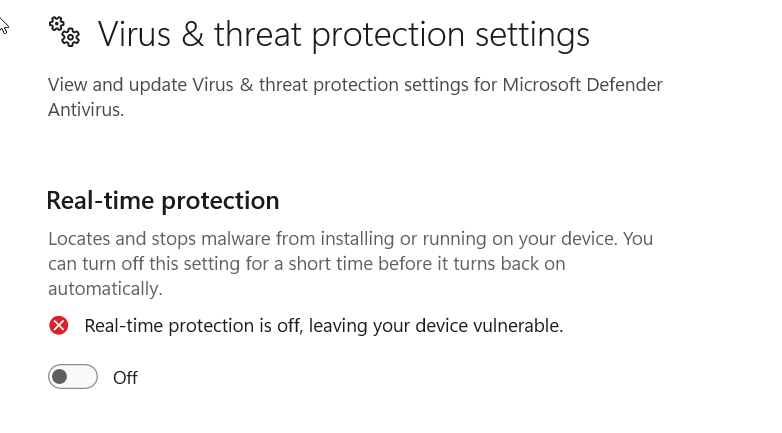

> **In production environments**, attackers bypass Defender through obfuscation, signed binary abuse, or exploiting misconfigurations — they do not simply turn it off.

---

### 2. RunAsPPL — Protected Process Light (PPL)

**RunAsPPL** is a Windows security feature introduced in Windows 8.1 that runs `lsass.exe` as a **Protected Process Light**. This prevents even Administrator-level processes from reading or dumping LSASS memory — only processes signed by Microsoft are permitted to interact with it.

**Registry location:**
```
HKEY_LOCAL_MACHINE\SYSTEM\CurrentControlSet\Control\Lsa
Value: RunAsPPL = 1  (Protected)
Value: RunAsPPL = 0  (Unprotected ← what we set)
```

**Disabled via:** `regedit → HKLM\SYSTEM\CurrentControlSet\Control\Lsa → RunAsPPL → set to 0`

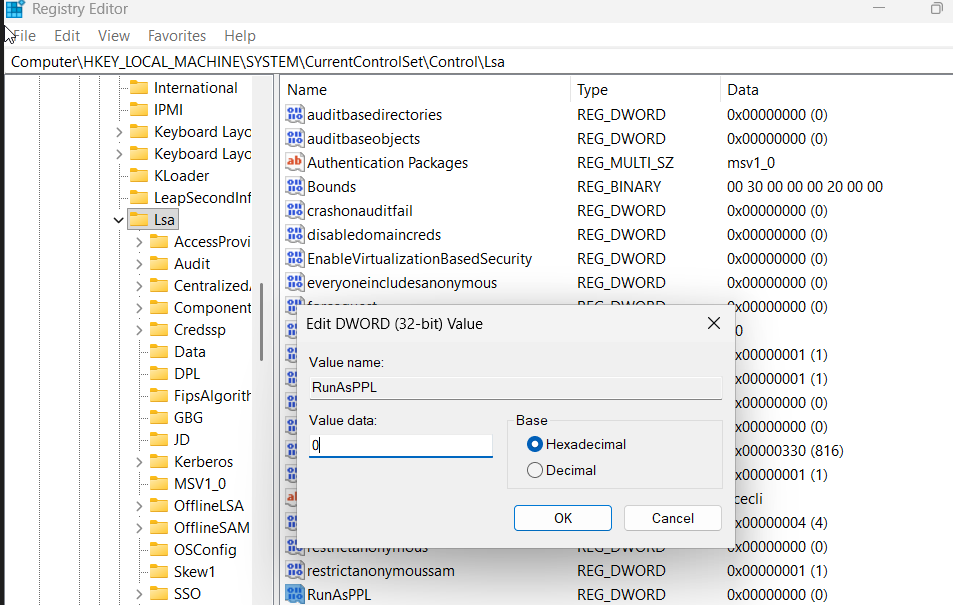

> When `RunAsPPL = 1`, any attempt to open a handle to LSASS with `PROCESS_VM_READ` access will be denied — even by SYSTEM-level processes. This is one of the most effective mitigations against credential dumping.

**After the attack, PPL was re-enabled:**

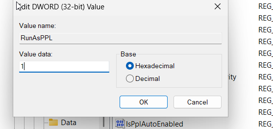

---

## ⚔️ Pre-Attack Setup

### Download ProcDump64

ProcDump is a **legitimate Sysinternals tool** by Microsoft, used by system administrators for process diagnostics. Attackers abuse its `-ma` (full memory dump) flag against LSASS.

**Official Download:** [https://learn.microsoft.com/en-us/sysinternals/downloads/procdump](https://learn.microsoft.com/en-us/sysinternals/downloads/procdump)

Verify ProcDump is present on the victim machine:

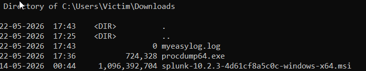

---

### Verify LSASS is Running

Before dumping, confirm `lsass.exe` is running and note its PID:

```cmd
tasklist | findstr lsass
```

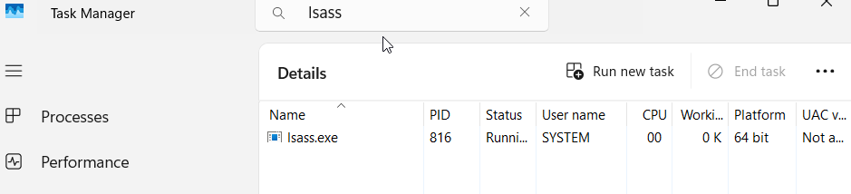

> LSASS always runs as SYSTEM and is a singleton process — there is only ever **one** instance. Seeing multiple `lsass.exe` processes is itself a red flag (potential hollowing or injection).

---

## 💥 Attack Execution

### Step 1 — Execute the Dump

With Administrator privileges, run:

```cmd
procdump64.exe -ma lsass.exe C:\Windows\Temp\lsass.dmp
```

**Flag breakdown:**

| Flag | Meaning |
|---|---|
| `-ma` | Full memory dump (all memory regions) |
| `lsass.exe` | Target process by name |
| `C:\Windows\Temp\lsass.dmp` | Output path (Temp used to blend in) |

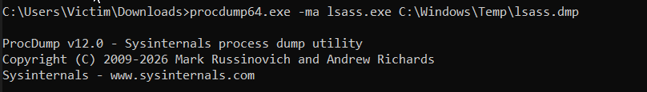

---

### Step 2 — Confirm Successful Dump

ProcDump prints a success message when the dump completes:

```
[09:15:32] Dump 1 initiated: C:\Windows\Temp\lsass.dmp
[09:15:33] Dump 1 writing: Estimated dump file size is 60 MB.
[09:15:34] Dump 1 complete: 62 MB written in 1.2 seconds
```

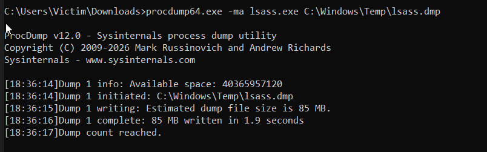

---

### Step 3 — Verify the Dump File

Confirm `lsass.dmp` was created in `C:\Windows\Temp\`:

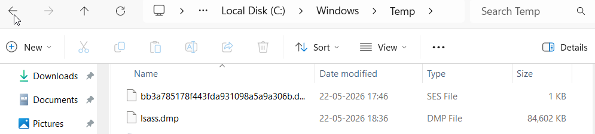

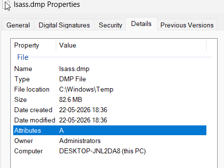

> The dump file is typically **50–150 MB** depending on how many users are logged in and how much credential material is cached.

---

### Step 4 — What Happens Next (Post-Exploitation)

Once the attacker has `lsass.dmp`, they exfiltrate it to their machine and parse it offline using **Mimikatz**:

```bash
# On Kali Linux with Mimikatz installed
mimikatz # sekurlsa::minidump lsass.dmp
mimikatz # sekurlsa::logonpasswords
```

This extracts:
- NTLM password hashes
- Plaintext passwords (if WDigest is enabled)
- Kerberos tickets (usable for Pass-the-Ticket)

---

## 🔍 Splunk Detection

All events were captured by **Sysmon** and forwarded to Splunk via the Universal Forwarder.

### Key Event IDs

| Event ID | Source | Description |
|---|---|---|
| **Sysmon 10** | Sysmon | Process Access — another process opened a handle to LSASS |
| **Sysmon 11** | Sysmon | File Created — `.dmp` file written to disk |
| **Windows 4656** | Security | Handle requested to LSASS object |
| **Windows 4663** | Security | Object access attempt on LSASS |

---

### SPL Query 1 — Detect .dmp File Creation

```spl
index=* EventCode=11 TargetFilename="*.dmp"
| table _time, Computer, Image, TargetFilename, ProcessGuid
| sort -_time
```

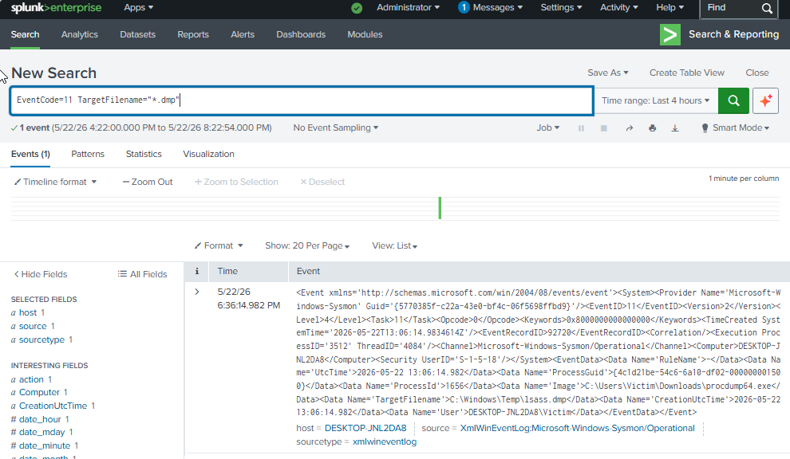

---

### SPL Query 2 — Detect Process Access to LSASS

```spl
index=* EventCode=10 TargetImage="*lsass.exe"
| table _time, Computer, SourceImage, TargetImage, GrantedAccess, CallTrace
| sort -_time
```

> `GrantedAccess: 0x1fffff` = full access to LSASS — a near-certain indicator of credential dumping.

---

### SPL Query 3 — Detect ProcDump Specifically

```spl
index=* EventCode=1
| search Image="*procdump*" OR CommandLine="*lsass*"
| table _time, Computer, User, Image, CommandLine, ParentImage
```

---

### SPL Query 4 — Detect Dump File in Suspicious Location

```spl
index=* EventCode=11
TargetFilename IN ("*\\Temp\\*.dmp", "*\\AppData\\*.dmp", "*\\Public\\*.dmp")
| table _time, Computer, Image, TargetFilename
```

---

### SPL Query 5 — Correlate Access + File Write (High Confidence Alert)

```spl
index=* (EventCode=10 TargetImage="*lsass*") OR (EventCode=11 TargetFilename="*.dmp")
| eval event_type=case(EventCode=10, "LSASS_Access", EventCode=11, "DMP_Written")
| stats count by host, event_type, _time
| where count >= 1
```

---

### Extracted Fields in Splunk

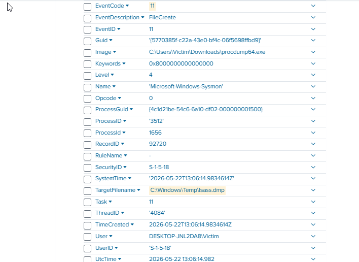

Key fields to monitor:
- `Image` — the process that accessed LSASS (should only be System/antivirus)
- `TargetFilename` — path of the written dump file
- `CommandLine` — full command used
- `GrantedAccess` — access rights requested on LSASS handle

---

## 🗺️ MITRE ATT&CK Mapping

| Tactic | Technique | ID | Detail |
|---|---|---|---|
| Credential Access | OS Credential Dumping: LSASS Memory | T1003.001 | ProcDump -ma against lsass.exe |
| Defense Evasion | Impair Defenses: Disable or Modify Tools | T1562.001 | Defender disabled pre-attack |
| Defense Evasion | Modify Registry | T1112 | RunAsPPL set to 0 |
| Discovery | Process Discovery | T1057 | lsass.exe identified via tasklist |
| Execution | Command and Scripting Interpreter | T1059 | CMD used to execute ProcDump |

---

## 🚨 IOC Summary

| Indicator | Type | Description |
|---|---|---|
| `procdump64.exe` | Process Name | Sysinternals tool abused for LSASS dump |
| `lsass.dmp` | Filename | Output dump file |
| `C:\Windows\Temp\*.dmp` | File Path | Suspicious dump location |
| `GrantedAccess: 0x1fffff` | Memory Access Flag | Full handle access to LSASS |
| `EventCode=10 → lsass.exe` | Sysmon Event | Process access to LSASS |
| `EventCode=11 → *.dmp` | Sysmon Event | Dump file written to disk |
| `RunAsPPL = 0` | Registry Value | PPL protection disabled |

---

## 🛡️ Mitigations & Hardening

### Re-enable RunAsPPL (Most Critical)

Set `RunAsPPL = 1` in the registry to prevent any non-Microsoft-signed process from accessing LSASS memory:

```
HKLM\SYSTEM\CurrentControlSet\Control\Lsa → RunAsPPL = 1
```


---

### Enable Credential Guard via Group Policy

**Credential Guard** uses **Virtualization-Based Security (VBS)** to isolate LSASS into a separate hypervisor-protected container (`LSAIso.exe`). Even if an attacker dumps LSASS memory, the credential material is encrypted and inaccessible.

**Path:** `gpedit.msc → Computer Configuration → Administrative Templates → System → Device Guard → Turn On Virtualization Based Security → Enabled`

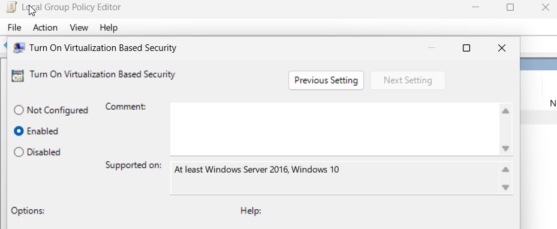

> Credential Guard is one of the **strongest mitigations** against Pass-the-Hash and LSASS-based credential theft. It requires Windows 10/11 Enterprise or Windows Server 2016+.

---

### Re-enable Windows Defender

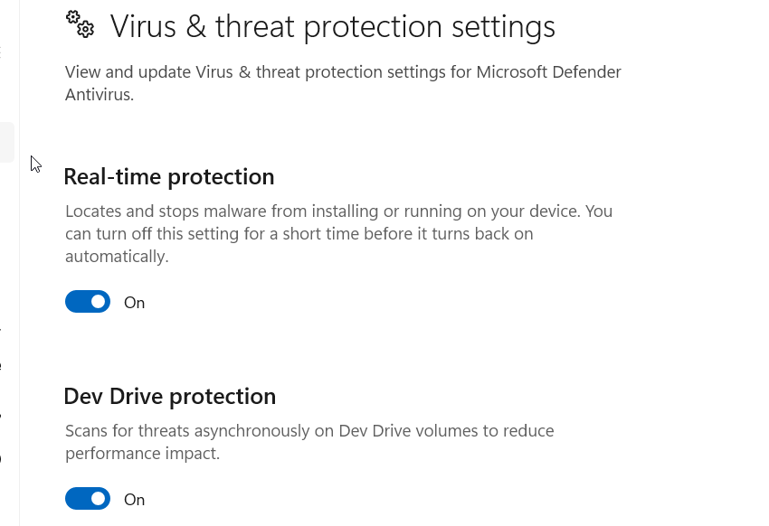

---

### Additional Hardening Checklist

```
✅ Enable RunAsPPL = 1
✅ Enable Credential Guard (Virtualization Based Security)
✅ Disable WDigest authentication (prevents plaintext caching)
   HKLM\SYSTEM\CurrentControlSet\Control\SecurityProviders\WDigest → UseLogonCredential = 0
✅ Enable Windows Defender + Attack Surface Reduction rules
✅ Monitor Sysmon Event 10 for lsass.exe access
✅ Alert on any .dmp file created outside of known paths
✅ Implement LAPS (Local Administrator Password Solution)
✅ Restrict ProcDump and Sysinternals tools via AppLocker
✅ Enable Protected Users Security Group for privileged accounts
```

---

## ⚠️ Lab Constraints Note

In this simulation, **Windows Defender and RunAsPPL were manually disabled** to isolate and observe the core LSASS dumping behavior.

In real-world intrusions, attackers typically:
- Target environments where PPL was **never configured** (common in unmanaged endpoints)
- Use **BYOVD (Bring Your Own Vulnerable Driver)** attacks to disable PPL from kernel mode
- Abuse **Task Manager** or **comsvcs.dll** (both Windows-signed) to bypass Defender
- Use **obfuscated or reflective** versions of Mimikatz to evade AV detection
- Exploit **existing admin privileges** obtained via phishing or privilege escalation

This lab focuses on understanding **the attack mechanics and building reliable detection logic** — the Splunk queries and Sysmon telemetry are fully realistic regardless of how the dump was obtained.

---

## 📚 References

- [MITRE ATT&CK T1003.001](https://attack.mitre.org/techniques/T1003/001/)
- [ProcDump — Microsoft Sysinternals](https://learn.microsoft.com/en-us/sysinternals/downloads/procdump)
- [Credential Guard Documentation](https://learn.microsoft.com/en-us/windows/security/identity-protection/credential-guard/)
- [Sysmon Configuration Reference](https://learn.microsoft.com/en-us/sysinternals/downloads/sysmon)
- [Protected Users Security Group](https://learn.microsoft.com/en-us/windows-server/security/credentials-protection-and-management/protected-users-security-group)

---

*Documented as part of a self-built cybersecurity homelab. All simulations performed in an isolated lab environment on machines I own.*
