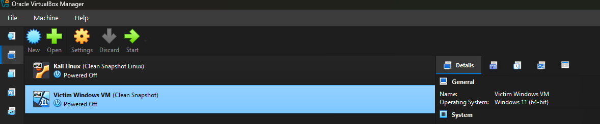

# 🏠 Home Lab Setup

This section documents the complete setup of my personal cybersecurity home lab built using **Oracle VirtualBox**. The lab consists of two isolated virtual machines — one acting as the **attacker** (Kali Linux) and one as the **victim** (Windows 11 Enterprise) — designed to simulate real-world attack and defense scenarios in a safe, controlled environment.

---

## 📋 Table of Contents

- [Virtualization Platform](#-virtualization-platform)
- [Virtual Machines](#-virtual-machines)
- [Network Configuration](#-network-configuration)
- [Lab Preview](#-lab-preview)
- [Why This Setup?](#-why-this-setup)

---

## 💻 Virtualization Platform

### Oracle VirtualBox

All virtual machines in this lab are hosted on **Oracle VirtualBox**, a free and open-source Type-2 hypervisor.

| Detail | Info |
|--------|------|
| Software | Oracle VirtualBox |
| Version Used | 7.x (Latest Stable) |
| Host OS | Windows 10/11 |
| License | Free & Open Source |

📥 **Download VirtualBox:** [https://www.virtualbox.org/wiki/Downloads](https://www.virtualbox.org/wiki/Downloads)

> **Installation Tip:** During installation, allow VirtualBox to install network adapter drivers when prompted — these are required for VM networking.

---

## 🖥️ Virtual Machines

Two ISO images were downloaded and configured inside VirtualBox:

---

### 1. 🐉 Kali Linux — Attacker Machine

Kali Linux is a Debian-based penetration testing distribution maintained by Offensive Security. It comes pre-loaded with 600+ security tools including Nmap, Metasploit, Wireshark, Burp Suite, and more.

| Detail | Info |
|--------|------|
| Role | Attacker |
| OS | Kali Linux (64-bit) |
| Snapshot Name | Clean Snapshot Linux |
| Status | Powered Off (Clean State) |
| RAM Allocated | 2–4 GB (Recommended) |
| Storage | 20–50 GB (Recommended) |

📥 **Download Kali Linux ISO:** [https://www.kali.org/get-kali/#kali-installer-images](https://www.kali.org/get-kali/#kali-installer-images)

> **Tip:** Download the **Installer** image (not live) for a full persistent installation. Choose the 64-bit version for best compatibility.

---

### 2. 🪟 Windows 11 Enterprise — Victim Machine

Windows 11 Enterprise is used as the target/victim machine to simulate attacks on a real Windows environment — including malware execution, privilege escalation, and lateral movement.

| Detail | Info |
|--------|------|
| Role | Victim / Target |
| OS | Windows 11 Enterprise (64-bit) |
| Snapshot Name | Clean Snapshot |
| Status | Powered Off (Clean State) |
| RAM Allocated | 4 GB (Recommended) |
| Storage | 50–80 GB (Recommended) |

📥 **Download Windows 11 Enterprise ISO (90-Day Eval):** [https://www.microsoft.com/en-us/evalcenter/evaluate-windows-11-enterprise](https://www.microsoft.com/en-us/evalcenter/evaluate-windows-11-enterprise)

> **Tip:** The Evaluation version is free for 90 days — perfect for lab use. No product key is required during installation.

---

## 🌐 Network Configuration

Both VMs are configured on an **Internal Network** (or **Host-Only Adapter**) within VirtualBox. This ensures:

- ✅ The VMs can communicate with each other
- ✅ The attacker machine can reach the victim machine
- ❌ No traffic leaks to your real home/work network
- ❌ No accidental exposure to the internet during attack simulations

**Recommended VirtualBox Network Mode:** `Internal Network` or `NAT Network`

To configure:
1. Select VM → **Settings** → **Network**
2. Set Adapter 1 to **Internal Network**
3. Give both VMs the **same network name** (e.g., `labnet`)
4. Assign static IPs manually inside each VM if needed

---

## 🖼️ Lab Preview

Below is a screenshot of the VirtualBox Manager showing both machines set up and ready with clean snapshots:

> Both machines are saved at a **Clean Snapshot** state — this allows instant rollback to a fresh environment after each attack simulation, keeping the lab reusable.

---

## 🤔 Why This Setup?

| Goal | How This Lab Achieves It |
|------|--------------------------|
| Safe attack simulation | Isolated network — no risk to real systems |
| Repeatable experiments | Snapshots allow instant VM reset |
| Industry-relevant tools | Kali Linux mirrors real-world pentesting environments |
| Windows exploitation practice | Enterprise OS matches corporate target environments |
| Zero cost | VirtualBox is free; Kali & Windows Eval are free |

---

## ⚠️ Disclaimer

> This lab is built **strictly for educational purposes**. All attack simulations are performed in an isolated, self-contained virtual environment. No techniques documented here are used against any unauthorized systems. Always ensure you have **explicit permission** before testing on any network or system.

---
